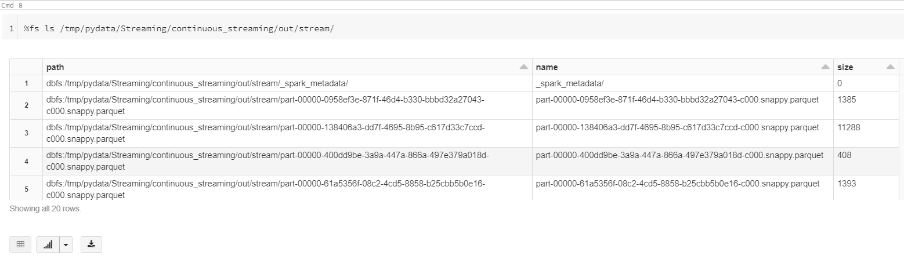
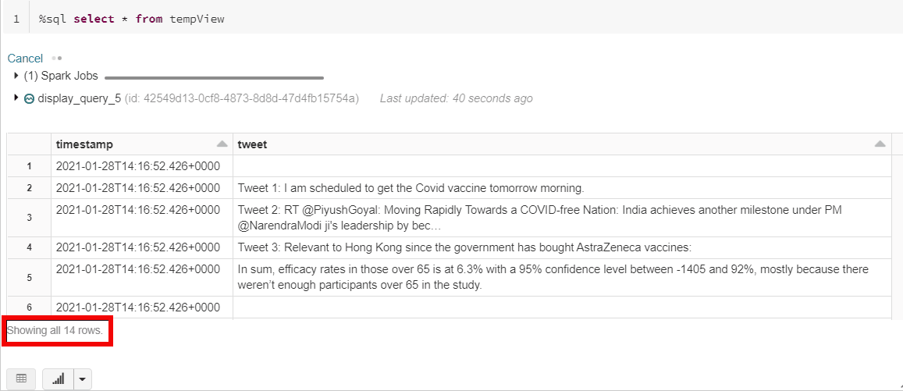
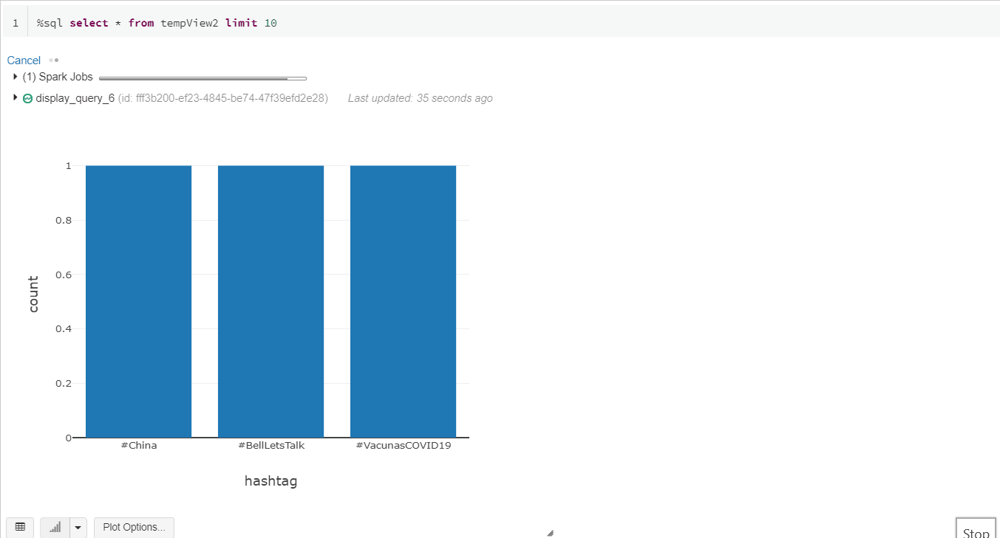

# Spark Structured Streaming - processing a stream of tweets

## General info
The purpose of the project is to build an application to create a database of tweets (text only) and visualize the most popular hashtags from those tweets with a live chart.
	
## Setup
To run this project:
1. Set up a Twitter developer account.
2. Save the api_key, api_secret_key access, access_token and access_token_secret in own "keys.py" file - they will be used to get access to Twitter API by the application.
3. Register to a Databricks community edition platform.
4. Set up a new cluster. 
5. Import the files to your Databricks workspace: your own keys.py, and the two source files from this repo: "tweetStream clean.dbc" and "sparkStreaming.dbc"
6. Run the two imported notebooks.


## Part 1: Start the stream

The notebook "tweetStream clean.dbc" contains the code to set up the connection to Twitter and a TweetListener class which specifies what happens once Twitter sends the tweets.

### 1.1 Set up the connection to Twitter

Start by creating a socket and configuring Twitter access with the developer keys (stored in a separate notebook which I import with ```%run ./keys``` at the start). Then, proceed to start the stream of tweets by calling the TweetListener class (described below in section 1.2). I decided to filter the tweets which contain keyword "vaccine". Finally, it closes the connection and socket once the streaming is done (once the limit of 1000 tweets is reached - I've chosen 1000 for illustration purposes. Note that Twitter imposes limits on their service use on their end). 

```python
client_socket = socket.socket()  # create a socket 
    
# app will use localhost and port 9876
client_socket.bind(('localhost', 9876))  
 
print('Waiting for connection')
client_socket.listen()  # wait for client to connect
    
# when connection received, get connection/client address
connection, address = client_socket.accept()  
print(f'Connection received from {address}')
 
# configure Twitter access
auth = tweepy.OAuthHandler(api_key, api_secret_key)
auth.set_access_token(access_token, access_token_secret)
    
# configure Tweepy to wait if Twitter rate limits are reached
api = tweepy.API(auth, wait_on_rate_limit=True, wait_on_rate_limit_notify=True)               
 
# create the Stream
twitter_stream = tweepy.Stream(api.auth, TweetListener(api, connection))
twitter_stream.filter(track=['vaccine']) 

connection.close()
client_socket.close()
```

### 1.2 The TweetListener class

The TweetListener class defines what happens when the application connects to Twitter:
1. Notifies that a connection was successfully established.
2. Tracks the number of tweets received.
3. Prints out the body of the tweet text.
4. And, finally, sends the text to the client application which is listening on the socket. Note that I've augmented each tweet before sending it to the client application to make it easier to track the start and the end of the tweet by the client application.

```python
class TweetListener(tweepy.StreamListener):

    def __init__(self, api, connection, limit=1000):
        """Create instance variables for tracking number of tweets."""
        self.connection = connection
        self.tweet_count = 0
        self.TWEET_LIMIT = limit  # 1000 by default
        super().__init__(api)  # call superclass's init

    def on_connect(self):
        """Called when your connection attempt is successful."""
        print('Successfully connected to Twitter\n')

    def on_data(self, data):
        """Called when Twitter pushes a new tweet"""
        
        # track number of tweets processed
        self.tweet_count += 1  
        print(self.tweet_count)
        
        # capture the full tweet message with properties in JSON format:
        json_data = json.loads(data)
        
        # print out the text of the tweet:
        try:
            # in case the tweet is longer than 140 characters, need to access extended_tweet property
            tweetStr = json_data['extended_tweet']['full_text']
        except Exception as e:
            try:
                # in case it's 140 characters, use text property
                tweetStr = json_data['text']
            except KeyError:
                return True
        print(tweetStr)
        
        # send the message to tweet listener
        try:
            # send requires bytes, so encode the string in utf-8 format
            self.connection.send(("Tweet " + str(self.tweet_count) + ": " + tweetStr + "t_end").encode('utf-8'))
        except Exception as e:
            print(f'Error: {e}')

        # if TWEET_LIMIT is reached, return False to terminate streaming
        return self.tweet_count < self.TWEET_LIMIT
    
    def on_error(self, status):
        print(status)
        return True
```

## Part 2: Process the streem of tweets

The "sparkStreaming.dbc" notebook contains the client application which consumes the stream of tweets from the socket, saves the tweets in Parquet files, and visualizes live the 10 most popular hashtags from these tweets.

### 2.1 Start the stream

After the initial set-up, the following bit of code configures the stream. Note that the TextSocketSource doesn't provide any integrated parsing options, so I can't apply a schema on the data at this stage, but I am adding a timestamp for when the tweet arrived:

```python
tweet_df = sc \
        .readStream \
        .format("socket") \
        .option("host", "localhost") \
        .option("port", 9876) \
        .option("includeTimestamp", "true") \
        .load()
```

Then, I create another dataframe which splits the stream of text into separate tweets based on the 't_end' 

```python
data = tweet_df.select([explode(split(tweet_df.value,"t_end")).alias("tweet"),"timestamp"])
```

The next bit below starts the streaming to save the tweets in parquet files at the destination path defined earlier. 

```python
query = (data
         .writeStream
         .format("parquet") # sink to save the tweets
         .option("path", output_path)
         .option("checkpointLocation", checkpoint_path) # add checkpointing 
         .outputMode("append")
         .trigger(processingTime='5 seconds')
         .start() 
        )
```

The following figure shows the files being created in the destination folder:



### 2.2 Inspect the tweets

Then, in order to visualize how the tweets saved in the Parquet files look (from the previous step), I start another job to read from these files:

```python
parquetSchema = (
  StructType()
  .add("timestamp", TimestampType()) #event time at the source
  .add("tweet", StringType()))

tt = (#spark.readStream
          sc \
           .readStream \
           .schema(parquetSchema)
           .format("parquet")
           .option("maxFilesPerTrigger", 1) #slow it down to demo
           .load(output_path)
          )

# generate temp table for inspection
tt.createOrReplaceTempView("tempView")
```

I can query from the temp view (```%sql select * from tempView```) to see the tweets live:




### 2.3 Plot the top hashtags

The last bit is to extract the hashtags from the tweets and visualize the most popular ones in a chart which is updating live as new tweets come in:

```python
hashtags = tt.withColumn('hashtag', explode(split(col('tweet'), ' '))) \
    .groupBy('hashtag') \
    .count() \
    .sort('count', ascending=False). \
    filter(col('hashtag').contains('#'))

writeTweet = hashtags.writeStream. \
          outputMode("complete"). \
          format("memory"). \
          queryName("topHashtags"). \
          start()

hashtags.createOrReplaceTempView("tempView2")
```

Again, I query from another temp view to see results as they come in (```%sql select * from tempView2 limit 10```):




Sources:
1. "Python for Programmers" by Paul J. Deitel and Harvey Deitel; 2019.
2. "Writing Continuous Applications with Structured Streaming PySpark API - Jules Damji Databricks" - a YouTube video and associated files.
